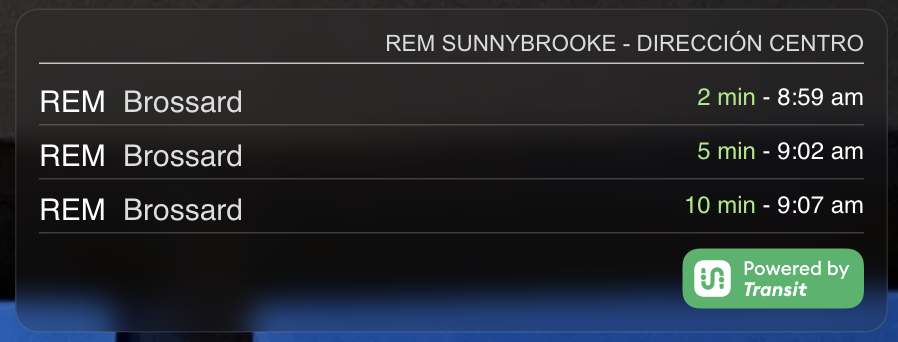

# MMM-PublicTransit

This [MagicMirror](https://magicmirror.builders/) module displays upcoming bus or train times from any transit stop across [150+ transit agencies in 25 countries](https://transitapp.com/en/region).  See if your stop is served by [Transit](https://transitapp.com/) using their app before investing time in this module!



## Breaking Changes
Nov 19, 2025: The configuration variable `global_stop_id` has been renamed to `global_stop_ids` to support showing multiple stops.
## Use Case

Use this module to see upcoming departures from a bus or train stop of interest.

Some transit agencies provide a standardized GTFS feed for real-time transit updates. But many supply their own API, or sometimes no programmatic way to access their transit times at all. Transit App partners with local transit agencies and combines it with crowdsourced data, to provide a standard, high-quality feed for public transit in most of North and South America and much of Europe. 


## Alternatives
1. If your transit agency publishes their schedule in GTFS format, [MMM-transitfeed](https://github.com/bnitkin/MMM-transitfeed) will work for you and does not need an API key. On the plus side, you can refresh departure times as frequently as you desire. The downside may be that the configuration is somewhat more complex and specific to your local public transit agency.

2. There are a few modules that use the Google Maps API: e.g., [MMM-GoogleBusSchedule](https://github.com/studio-1b/MMM-GoogleBusSchedule) and [MMM-LocalTransport](https://github.com/CFenner/MMM-LocalTransport). Unfortunately, as the Google Directions API is being deprecated, some of these may not work as intended unless the modules are re-written to use the Routes API. I have not tested which one of these still work. You will need a credit card for Google Cloud Platform, even if you limit yourself to the free tier.

If you found this module useful, please consider leaving a star on GitHub so others may find it. Thank you!

## Pre-requisites

Before you begin, ensure you have:

1.  A working [MagicMirror²](https://magicmirror.builders/) installation.
2.  [Request an API key](https://transitapp.com/apis) from Transit App.  See the Transit App documentation for details.
3.  Get the bus/train station code using the `/public/nearby_stops` endpoint through a bash terminal.

```bash
sudo apt update
sudo apt install curl jq
npm install node-fetch

API_KEY=(Your Transit App API key)
STATION_LATITUDE=(Latitude of your bus/train stop)
STATION_LONGITUDE=(Longitude of your bus/train stop)
LOCATION_PRECISION=200

curl  -H "Accept-Language:en" -H "apiKey:$API_KEY" "https://external.transitapp.com/v3/public/nearby_stops?max_distance=$LOCATION_PRECISION&lat=$STATION_LATITUDE&lon=$STATION_LONGITUDE" | jq
```
If you don't see any results from the API response, the location you provided is not close to any stops in Transit's database. You may increase `LOCATION_PRECISION` up to 1500 meters to show more nearby stops. Also, make sure you are using the location of the bus/train stop of interest and not your location.

From the JSON response, make a note of the `"global_stop_id"` of the stop(s) you would like to monitor. It will be formatted as `"ABC:12345"`.

### Install

In your terminal, go to your MagicMirror² Module folder and clone MMM-Template:

```bash
cd ~/MagicMirror/modules
git clone https://github.com/thariq-shanavas/MMM-PublicTransit
```

## Using the module

To use this module, add it to the modules array in the `config/config.js` file:

```js
    {
        module: 'MMM-PublicTransit',
        position: 'top_right',
        header: 'Your Stop Name',
        config: {
            global_stop_ids: 'abc:1234',
            apiKey: ''
        }
    },
```

The free tier is limited to 1500 calls per month, or about one every 30 minutes. The display will update every 30 seconds, but the API calls are cached so you may see outdated information. To do more frequent API calls during your commute hours for better real-time info, consider setting the `activeHours` configuration value to disable refreshing when you do not need real-time transit times.

The terms and conditions of the Transit App API requires that the Transit Logo be shown next to the feed. Transit App provides a valuable service at no cost and I feel it is a very fair ask. However, this code is MIT licensed and 'free' as in freedom, so if you feel very strongly about the logo you may hide it from the configuration file.

## Configuration Options

| Option             | Description                                                                 | Default     |
| ------------------ | --------------------------------------------------------------------------- | ----------- |
| `global_stop_ids` (required)  | Comma separated list of global stop IDs from the Transit App API. If you need to display departures from only one stop, your configuration will look like this: `global_stop_ids: 'ABC:1234'`. To monitor multiple stations, separate the stations by a comma like this: `global_stop_ids: 'ABC:1234,XYZ:12345'`                              | `""`        |
| `apiKey` (required)           | Your Transit App API key.                                                   | `""`        |
| `showHeadSign`     | Show the head sign on the bus/train instead of the route name. Sometimes the eastbound and westbound routes have the same route name (e.g., the New York LIRR), in which case set this to `true`.                         | `false`     |
| `logosize`         | Size of the Transit logo.                                                   | `"40px"`    |
| `showlogo`         | Show or hide the transit logo (`true`, `false`)                                                   | `true`   |
| `displayed_entries`| Number of bus times to display.                                             | `3`         |
| `fontsize`         | Font size for bus times.                                                    | `"24px"`    |
| `logoLocation`     | Logo alignment (`flex-start`, `flex-end`).                                  | `"flex-end"`|
| `activeHoursStart` | Active hours start time (24-hour format).                                   | `6`         |
| `activeHoursEnd`   | Active hours end time (24-hour format).                                     | `22`        |
| `activeDays`       | Active days of the week (0 = Sunday, 6 = Saturday).                         | `[0, 1, 2, 3, 4, 5, 6]`|
| `updateFrequency`  | Update frequency in minutes. Recommendeded between 10 and 30. You will run out of your 1500 free API calls/month if you reduce the update frequency below 30 minutes without also shortening the period the module is active via `activeHoursStart`, `activeHoursEnd` and `activeDays`.               | `30`        |


### Update

```bash
cd ~/MagicMirror/modules/MMM-PublicTransit
git pull
```

## Debugging

If the module does not work as expected, please create a [github issue](https://github.com/thariq-shanavas/MMM-PublicTransit/issues/new/choose) and share the output of the following commands:

```bash
pm2 stop MagicMirror
cd ~/MagicMirror
npm start
```

## Known Issues

The Transit API has a limitation where it only returns a maximum of 3 future departures for any given route. For example, if the actual departures are:

1.  9:30 AM - Bus A
2.  9:35 AM - Bus A
3.  9:40 AM - Bus A
4.  9:45 AM - Bus A
5.  9:50 AM - Bus B

The API will return:

1.  9:30 AM - Bus A
2.  9:35 AM - Bus A
3.  9:40 AM - Bus A
4.  9:50 AM - Bus B

This behavior is a limitation of the Transit API and is unlikely to be fixed. The issue is partially mitigated by more frequent API calls.
